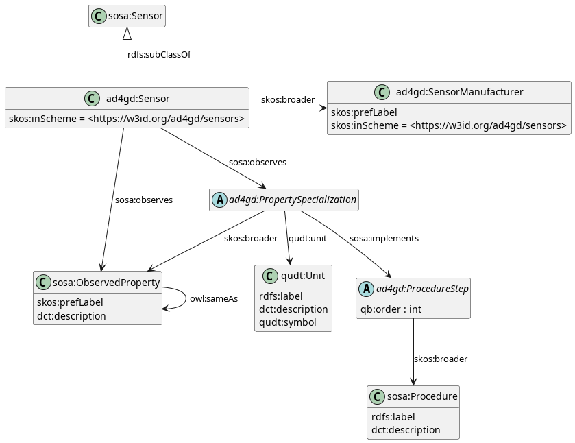

# Pilot 3 air quality & semantics

## Semantic uplift

The following files are semantically uplifted and published in the
[OGC RAINBOW hosted instance](https://defs-dev.opengis.net/vocprez-hosted):

* `generic/properties.yml`: AD4GD properties
* `generic/procedures.yml`: AD4GD procedures
* `generic/sensors.yml`: AD4GD sensors
* `generic/sensor-manufacturers.yml`: AD4GD sensor anufacturers)

New uplift entries can be configured inside `.ogc/catalog.ttl`
(see [Documentation and tutorials](#documentation-and-tutorials) below).

Please bear in mind that any `.ttl` files that you may find in this repository (apart from `.ogc/catalog.ttl`)
are most certainly going to be auto-generated, and thus you should not edit them directly because your changes
will be lost. The repository is set up to work with YAML/JSON files and JSON-LD uplift definitions (`*-uplift.yml`
files), and to generate (and publish) their RDF representations automatically.

### Documentation and tutorials

* [Example domain definition (like `.ogc/catalog.ttl`)](https://opengeospatial.github.io/ogc-na-tools/examples/#sample-domain-configuration)
* [How to create a JSON-LD uplift context definition](https://opengeospatial.github.io/ogc-na-tools/tutorials/#how-to-create-a-json-ld-uplift-context-definition)

## The data model

A simplified version of the pilot data model employed is shown below.



Further discussion on the rationale for some of the modeling decisions (such as how to link units of
measure and procedures to sensor definitions) can be found in
[this document](https://docs.google.com/document/d/1fzEKymhmAB4dVEEgJE3XXf4DTzPS60oj3wYzJQrZcrE/edit?usp=sharing).

### Working with observations

An example of a sensor type defined according to the model above could be (some properties omitted for clarity):

```turtle
<https://w3id.org/ad4gd/sensors/Nova-Fitness/SDS011> a skos:Concept, owl:Class ;
  rdfs:subClassOf sosa:Sensor ;
  sosa:observes [
    qudt:hasUnit unit:MicroGM-PER-M3 ;
    skos:broader ad4gd-prop:pm10 ;
    ssn:implements [ qb:order 1 ; skos:broader ad5gd-procedure:pm-humidity-correction ] ;
  ]
.
```

This would represent a sensor that observes PM10 concentration (`ad4gd-prop:pm10`) using μg/m³ (`unit:MicroGM-PER-M3`),
and implementing a humidity correction procedure (`ad5gd-procedure:pm-humidity-correction`).

Apart from their numeric value, it is expected that observations will only include a reference to the
sensor type and a reference to the generalized observable property that has been measured. So, for example, we would
have:

```turtle
_:obs75134 a sosa:Observation ;
  sosa:madeBySensor [
    a <https://w3id.org/ad4gd/sensors/Nova-Fitness/SDS011> ;
    dct:identifier "SN/2313Q432"
  ] ;
  sosa:observedProperty ad4gd-prop:pm10 ;
  sosa:hasSimpleResult 0.323 ;
.
```

The above observation was made by a sensor of type SDS011 with serial number "SN/2313Q432", its observed property is
PM10, and it has a result of 0.323. If a consumer encounters this observation, it can retrieve the information about the
sensor type and match the observed property to the one declared inside its `sosa:observes`, making it possible to infer
new metadata, resulting in the following full description for the observation:

```turtle
_:obs75134 a sosa:Observation ;
  sosa:madeBySensor [
    a <https://w3id.org/ad4gd/sensors/Nova-Fitness/SDS011> ;
    dct:identifier "SN/2313Q432"
  ] ;
  sosa:observedProperty ad4gd-prop:pm10 ;
  sosa:hasSimpleResult 0.323 ;
  sosa:hasResult [
    qudt:numericValue 0.323 ;
    qudt:unit unit:MicroGM-PER-M3 ;
  ] ;
  sosa:usedProcedure [ qb:order 1 ; skos:broader ad5gd-procedure:pm-humidity-correction ] ;
.
```

### The SOSA model

For reference, the observation perspective of the [SOSA/SSN ontology](https://www.w3.org/TR/vocab-ssn/) model follows.


