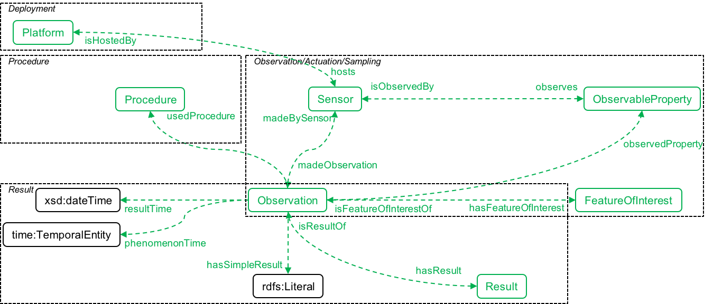

# Pilot 3 air quality & semantics

## Semantic uplift

The following files are semantically uplifted and published in the
[OGC RAINBOW hosted instance](https://defs-dev.opengis.net/vocprez-hosted):

* `generic/properties.yml`: AD4GD properties
* `*/sensors.yml`: AD4GD sensors.

## The SOSA model

From the [SOSA/SSN ontology](https://www.w3.org/TR/vocab-ssn/).

